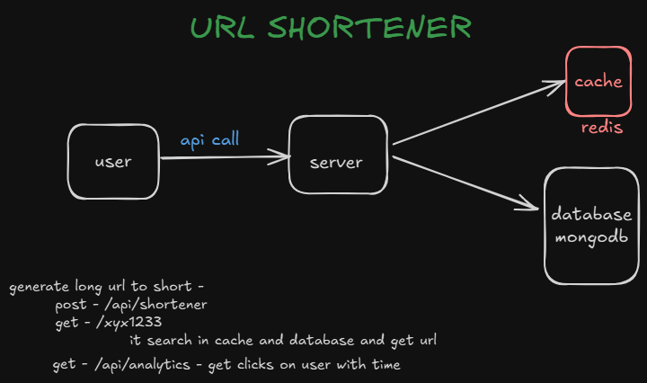

## 🔗 URL Shortener

A full-stack URL shortener application with:

- ✨ Frontend: React  (`npm run dev`)
- 🛠️ Backend: Node.js, Express (`nodemon index.js`)
- ⚡ Redis for caching via Docker
- 🌍 MongoDB Atlas for persistent storage

---

## Architecture



---

## 📁 Project Structure

```
├── client/ # Frontend (React)
│ └── ...
├── server/ # Backend (Node.js, Express)
│ ├── index.js
│ ├── model/
│ ├── routes/
│ └── .env
└── docker-compose.yml (optional)

```
---

## ⚙️ Prerequisites

- Node.js & npm
- Docker (for Redis)
- MongoDB Atlas connection string
- `nodemon` installed globally (`npm i -g nodemon`)

---


## 🐳 Step 1: Start Redis in Docker

Run the following in your terminal to start Redis using Docker:

```
docker run --name redis-url -p 6379:6379 -d redis
```
This will run Redis on port 6379.

## 🔐 Step 2: Configure Environment Variables

Inside server/.env, add your MongoDB Atlas URI:

env
```
DATABASE_URL=mongodb+srv://<username>:<password>@cluster.mongodb.net/shortener
```
---

## 🚀 Step 3: Start the Server
Navigate to the server directory and start the backend:


```
cd server
npm install
nodemon index.js
```
This will start your Express server on your specified port (default: 3000).

## 🌐 Step 4: Start the Client

Navigate to the client directory and run:
```
cd client
npm install
npm run dev
```
This starts the frontend on http://localhost:5173.

## 📌 Features
- Create short URLs for long links

- Redis cache for performance boost

- MongoDB persistence for storage

- Full-stack separation with scalable design


## 🧪 API Endpoints (example)

| Method | Endpoint           | Description                                |
|--------|--------------------|--------------------------------------------|
| POST   | `/api/shortener`   | Create a new short URL                     |
| GET    | `/:shortId`        | Redirect to original URL (cache+db lookup) |
| GET    | `/api/analytics`   | Get click analytics with timestamp         |


## 🛠 Tech Stack
- Frontend: React 

- Backend: Node.js, Express

- Database: MongoDB Atlas

- Cache: Redis via Docker

## 🧹 Troubleshooting
- Redis not running? Re-run the Docker command above.

- "Error: headers already sent"? Make sure to return or res.end() after a response.

- MongoDB issues? Double-check your .env DATABASE_URL.

## 📄 License
This project is licensed under MIT. Feel free to use and modify.

## ✨ Credits
Made with  by Anak Vyas